# Voynich Manuscript Decoder

A Java application for analyzing and decrypting the Voynich manuscript using frequency analysis and Caesar cipher methods. Also includes Dictionaries for various languages
with common words in each language for cookbooks, poems and regular conversations. the code will tell you if any words from the 
dictionaries are detected

## Features
- Frequency analysis for multiple languages ~English, Italian, Latin, Spanish~
- Decryption using Caesar cipher brute force
- Read ciphertext input from a file
- Detect if any words from dictionary is in the cipher in English, Italian, Latin, and Spanish

## How to Use
1. Put the ciphertext in a file named "vciphertext.txt" in the projects folder
2. Run the program in IntelliJ
3. View the results in the console

## Requirements
- Java 22 
- IntelliJ IDEA
- Oracle OpenJDK 22.0.2-aarch64

### *What Does Potential Match mean?*
- Potential Match means that the cipher has a lot of common letter patterns and could hide real words from each respective language even though its not clear
# Captures
### Page 94r (Page I Used)
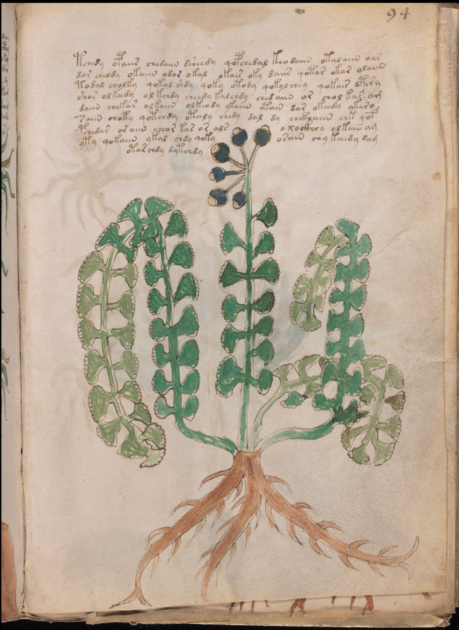
### Page 95r (Page I Used)
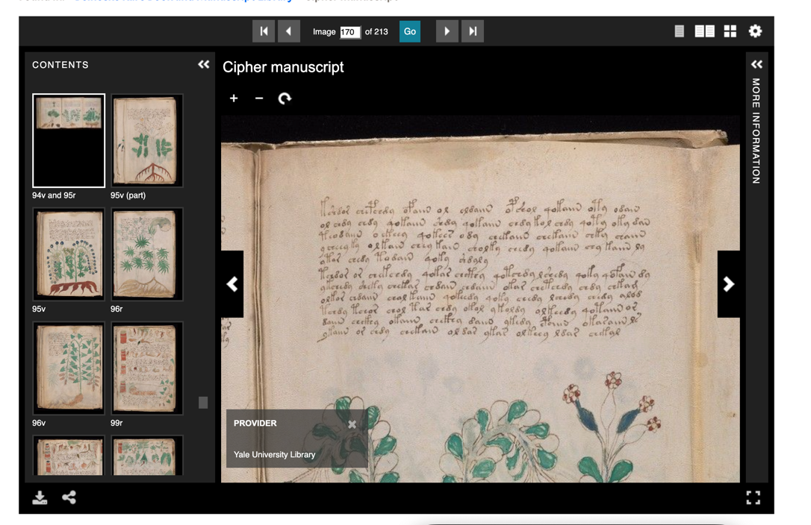
### Page 53v (Page I Used)
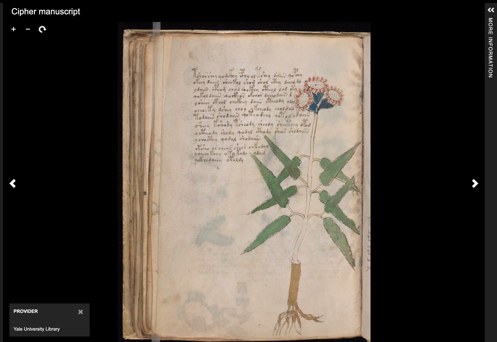
### Page 44v (Page I Used)
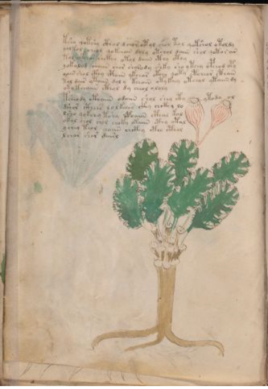
#### Brute For Potential Match Spanish
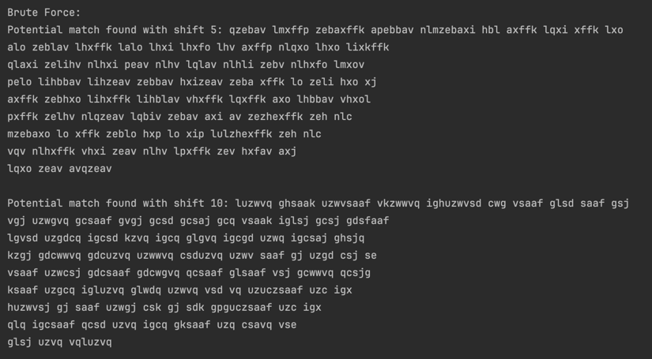
#### Brute Force Potential Match for English
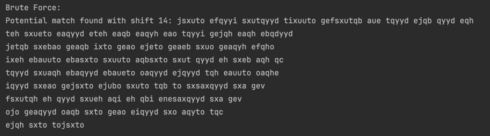
#### Brute Force Potential Match for Italian
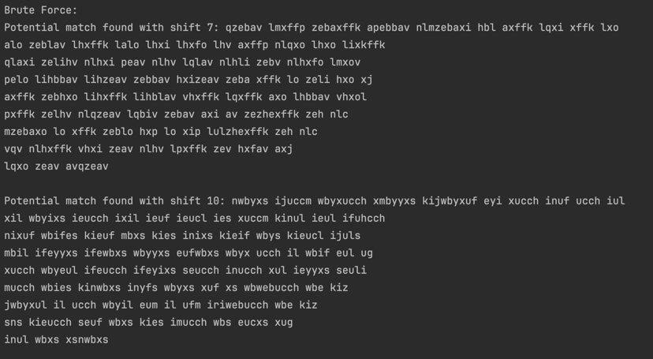
#### Brute Force Potential Match for Latin
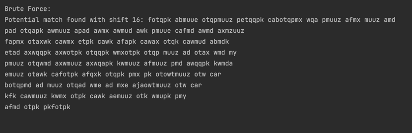
#### Examples of Handwriting Each Line on iPad
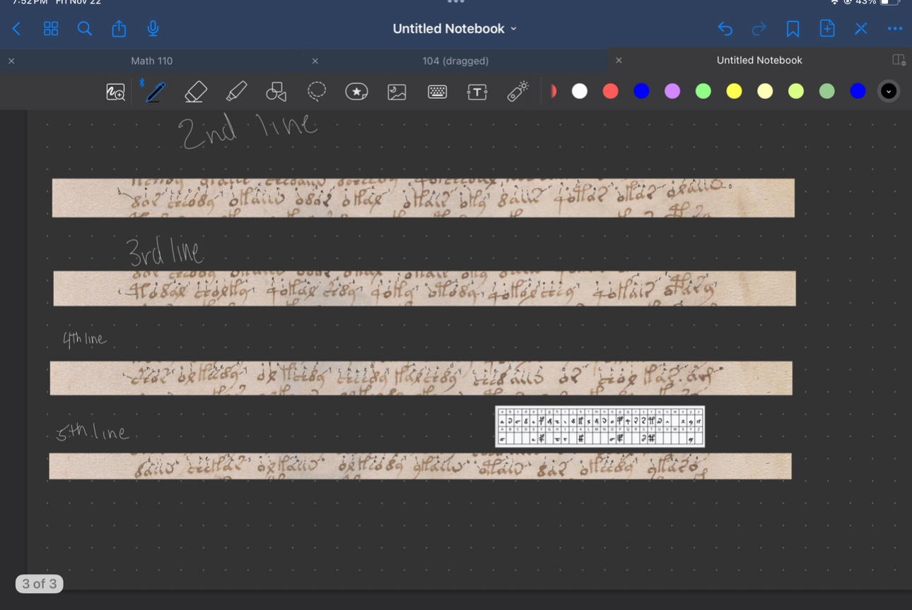
#### Freq Analysis for English (best guess)
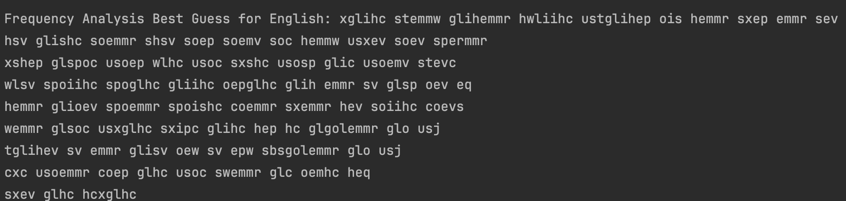
#### Freq Analysis for Italian (best guess)
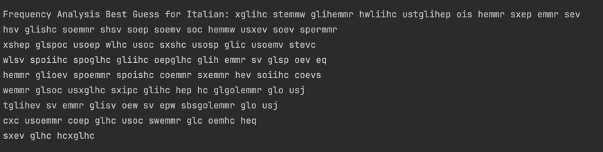
#### Freq Analysis for Latin (best guess)
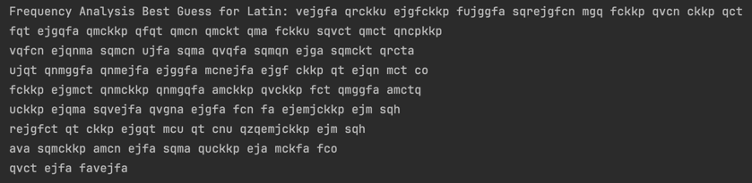
#### Freq Analysis for Spanish (best guess)
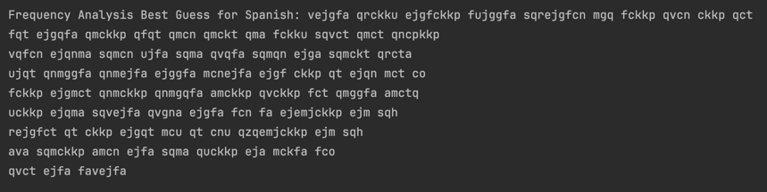
#### Handwriting manuscript page
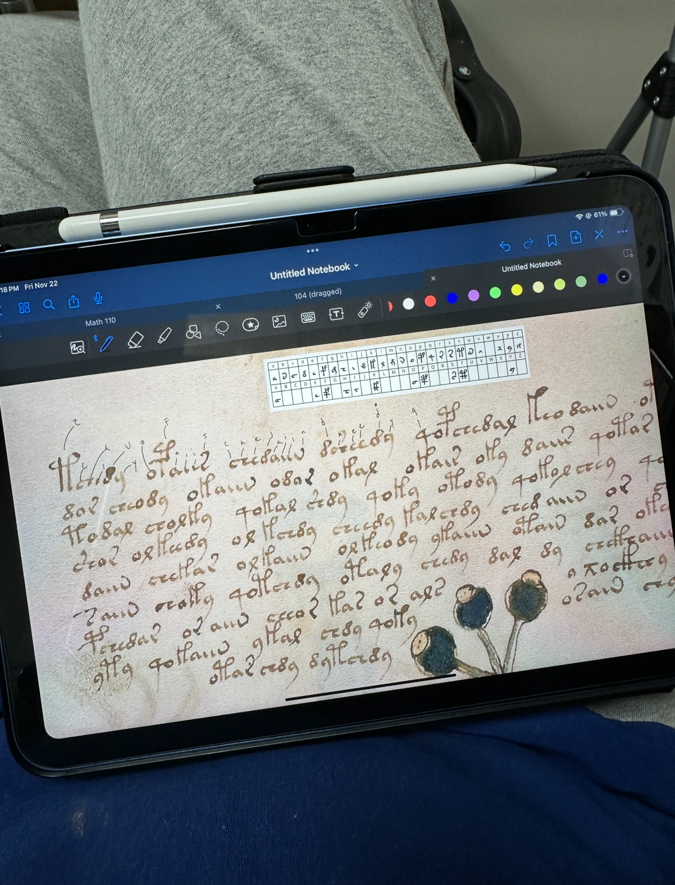
#### Percentage Comparison between letters in Voynich and English
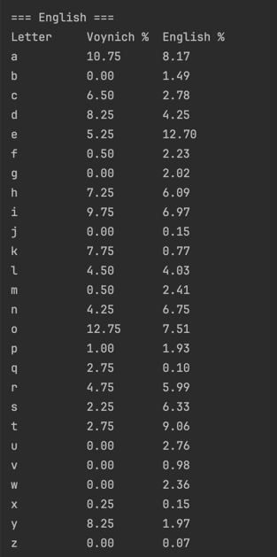
#### Percentage Comparison between letters in Voynich and Italian
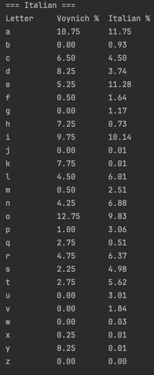
#### Percentage Comparison between letters in Voynich and Latin
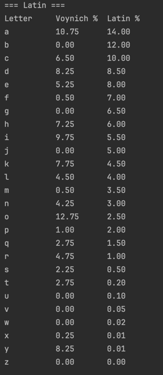
#### Percentage Comparison between letters in Voynich and Spanish
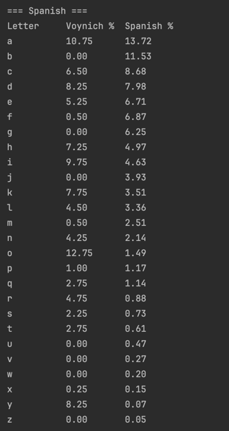
#### Showing the Dictionaries are loaded and Ready
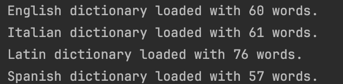
#### What i used to Translate
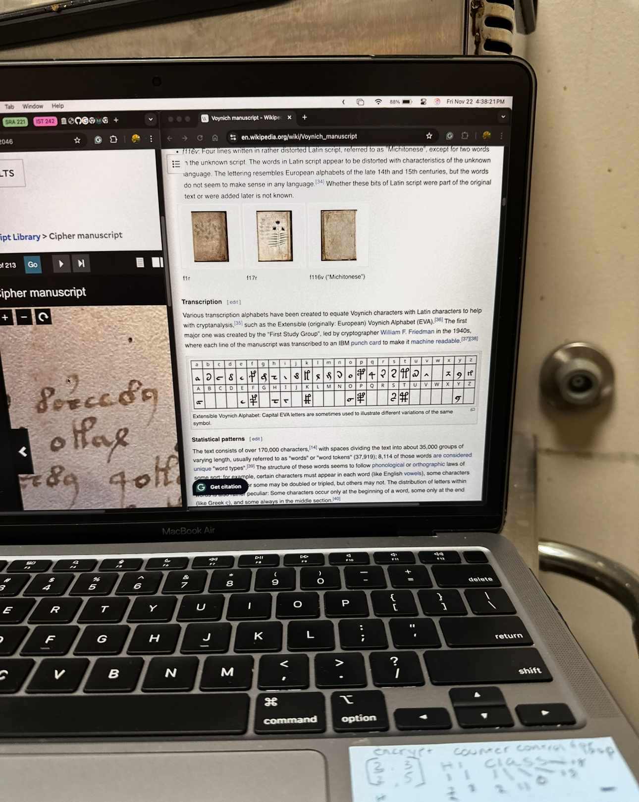